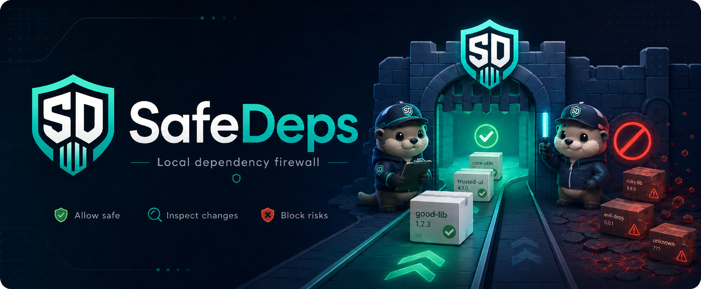

# SafeDeps

[](https://github.com/jaydemks/SafeDeps/actions/workflows/ci.yml)
[](https://github.com/jaydemks/SafeDeps/actions/workflows/safedeps.yml)




SafeDeps is a local dependency firewall.

It checks dependency changes before they are installed, committed, or accepted in CI. The goal is simple: make risky dependency changes harder to introduce by accident.

This is useful when developers, scripts, or AI coding agents can add packages to a project.

SafeDeps does not try to prove that every package is safe. It enforces your dependency policy before the change goes through.

After installation, configure the guard before relying on protected installs:

```bash
safedeps setup .
```

Alternatively, open the local UI with `safedeps ui .` and use the **Setup Guard** button.

## Quick example

With the guard active, this is blocked:

```bash
pip install requests
```

```text
Blocked: unpinned runtime install is not allowed.
Use exact versions (example: package==1.2.3).
```

This can pass, if the project policy allows it:

```bash
pip install requests==2.32.3
```

Before the install is allowed, SafeDeps scans the project and fails the operation if blocking findings are found.

## Current status

SafeDeps is strongest today for Python and pip workflows.

| Area | Status |
| --- | --- |
| Python project scanning | Supported |
| `pip` runtime guard | Tested |
| `python -m pip` runtime guard | Tested |
| Local web UI | Tested for guard toggles and scan flows |
| npm scanning | Supported |
| npm runtime guard | Implemented, still being validated across environments |
| NuGet/.NET scanning | Supported |
| NuGet/.NET runtime flows | Implemented, still being validated across environments |
| Git submodule checks | Supported |

PyPI publishing is available:

```bash
pip install safedeps
```

The npm wrapper and .NET tool wrapper exist in this repository. npm and NuGet publishing are still being finalized.

## Install

For normal use:

```bash
python -m pip install safedeps
```

For local development from this repository:

```bash
git clone https://github.com/jaydemks/SafeDeps.git
cd SafeDeps
python -m pip install -e .[dev]
```

## Choosing the target installation

SafeDeps can be installed in more than one Python at the same time. This is common when you test the published PyPI package globally while developing the local repository inside a project `.venv`.

Use the Python executable explicitly when testing guard scope:

| Target | Use this interpreter | Typical source |
| --- | --- | --- |
| Project scope | `.\.venv-test\Scripts\python.exe` or `./.venv-test/bin/python` | local editable repo install |
| Global scope from PyPI | system Python, for example `py -3` on Windows or `python3` on Linux/macOS | `pip install safedeps` from PyPI |
| Global scope from repo | system Python, for example `py -3` on Windows or `python3` on Linux/macOS | local editable repo install |

Avoid using bare `python`, `pip`, or `safedeps` while switching targets unless you have just verified what they resolve to.

Verify the active SafeDeps installation:

```bash
python -c "import pathlib, safedeps, sys; print(sys.executable); print(safedeps.__version__); print(pathlib.Path(safedeps.__file__).resolve())"
```

On Windows, also check command resolution:

```powershell
where.exe python
where.exe pip
where.exe safedeps
```

## Clean reinstall and target switching (repo-local)

Use these commands from the repository root (`safedeps-Latest`) and only one block at a time.

`safedeps setup` is safe to rerun: it clears stale guard hooks/wrappers for PowerShell, CMD, Bash, PATH, and the Python interpreter startup hook, then regenerates them for the selected target. If Auto Guard was already enabled, setup re-syncs it after the new wrappers are written.

SafeDeps also installs an interpreter-level guard hook into the protected Python runtime. This is what blocks direct calls such as `C:\...\python.exe -m pip install six` that bypass shell aliases, PowerShell functions, CMD AutoRun, or PATH wrappers.

### Windows (PowerShell)

#### 1) Project scope (install into local `.venv`)

```powershell
deactivate

# 1) uninstall from project venv
& .\.venv-test\Scripts\python.exe -m pip uninstall -y safedeps

# 2) full local cleanup (removes previous .safedeps state)
.\scripts\reset-safedeps.ps1 -ProjectPath (Get-Location)

# 3) reinstall editable from this repo, then setup project guard
& .\.venv-test\Scripts\python.exe -m pip install -e .[dev]
& .\.venv-test\Scripts\python.exe -m safedeps.cli setup . --install-scope project
. .\.safedeps\activate.ps1
```

For CMD after setup:

```bat
.safedeps\activate.bat
```

#### 2) System scope (install globally from this repo)

These commands install SafeDeps at system level from this repository (explicit system Python install, **not** `.venv` pip).

```powershell
deactivate

# choose the exact system interpreter explicitly
$SystemPython = py -3 -c "import sys; print(sys.executable)"

# 1) uninstall from system python
& $SystemPython -m pip uninstall -y safedeps

# 2) full global cleanup
.\scripts\reset-safedeps.ps1

# 3) reinstall editable from this repo, then setup global guard
& $SystemPython -m pip install -e .[dev]
& $SystemPython -m safedeps.cli setup . --install-scope system --protection-scope global
. .\.safedeps\activate.ps1
```

For a PyPI/global smoke test instead of a local editable install, replace the reinstall command with:

```powershell
& $SystemPython -m pip install --upgrade safedeps
& $SystemPython -m safedeps.cli setup . --install-scope system --protection-scope global
```

For CMD after setup:

```bat
.safedeps\activate.bat
```

If you installed only a single command earlier and want to know what target you are touching, verify explicitly:

```powershell
python -c "import sys; print(sys.executable)"
where.exe python
where.exe pip
where.exe safedeps
```

### Linux, macOS, and WSL (Bash)

#### 1) Project scope (install into local `.venv`)

The commands below install/refresh SafeDeps **inside the project virtual environment** and rebuild the project guard in project mode.

```bash
deactivate || true

# 1) uninstall from project venv
./.venv-test/bin/python -m pip uninstall -y safedeps

# 2) full local cleanup (removes previous .safedeps state)
./scripts/reset-safedeps.sh "$(pwd)"

# 3) reinstall editable from this repo, then setup project guard
./.venv-test/bin/python -m pip install -e .[dev]
./.venv-test/bin/python -m safedeps.cli setup . --install-scope project
source ./.safedeps/activate.sh
```

#### 2) System scope (install globally from this repo)

These commands install SafeDeps at system level from this repository (explicit system Python install, **not** `.venv` pip).

```bash
deactivate || true

# choose the exact system interpreter explicitly
SYS_PY="$(command -v python3 || command -v python)"

# 1) uninstall from system python
"$SYS_PY" -m pip uninstall -y safedeps

# 2) full global cleanup
./scripts/reset-safedeps.sh

# 3) reinstall editable from this repo, then setup global guard
"$SYS_PY" -m pip install -e .[dev]
"$SYS_PY" -m safedeps.cli setup . --install-scope system --protection-scope global
source ./.safedeps/activate.sh
```

For a PyPI/global smoke test instead of a local editable install, replace the reinstall command with:

```bash
"$SYS_PY" -m pip install --upgrade safedeps
"$SYS_PY" -m safedeps.cli setup . --install-scope system --protection-scope global
```

If you installed only a single command earlier and want to know what target you are touching, verify explicitly:

```bash
python -c "import sys; print(sys.executable)"
python -m pip show safedeps
```

### UI smoke tests after reinstall

Use these commands from the repository root after running one of the reinstall blocks above.

#### Windows (PowerShell)

Project install UI test:

```powershell
& .\.venv-test\Scripts\python.exe -m safedeps.cli ui . --install-scope project --port 5207
```

Expected behavior:

- the `Global` toggle is disabled
- only project dependencies are shown
- package actions target the project virtual environment

System install UI test:

```powershell
$SystemPython = py -3 -c "import sys; print(sys.executable)"
& $SystemPython -m safedeps.cli ui . --install-scope system --port 5207
```

Expected behavior:

- the `Project` and `Global` toggles are both available
- `Project` protects only the selected project root
- `Global` protects guarded dependency commands globally in activated guard sessions

CMD activation test:

```bat
cd /d C:\path\to\safedeps-Latest
.safedeps\activate.bat
where pip
where python
pip install six
```

Expected behavior:

- `where pip` shows `.safedeps\bin\pip.cmd` first
- unpinned guarded installs are blocked according to the selected `Project` or `Global` scope

#### Linux, macOS, and WSL (Bash)

Project install UI test:

```bash
./.venv-test/bin/python -m safedeps.cli ui . --install-scope project --port 5207
```

System install UI test:

```bash
SYS_PY="$(command -v python3 || command -v python)"
"$SYS_PY" -m safedeps.cli ui . --install-scope system --port 5207
```

### Dependency action smoke tests with `six`

`six` is useful for manual smoke tests because it is normally not required by `pytest` in this repo environment. Do not use `colorama` for uninstall tests on Windows because `pytest` requires it.

#### Windows (PowerShell)

Project virtual environment test:

```powershell
.\.venv-test\Scripts\Activate.ps1
python -c "import pathlib, safedeps, sys; print(sys.executable); print(pathlib.Path(safedeps.__file__).resolve())"

# expected: blocked because the version is not pinned
python -m pip install six

# expected: allowed if the scan passes, then cleaned up
python -m pip install six==1.17.0
python -m pip show six
python -m pip uninstall -y six
```

Explicit project interpreter test:

```powershell
# expected: blocked because the version is not pinned
& .\.venv-test\Scripts\python.exe -m pip install six

# expected: allowed if the scan passes, then cleaned up
& .\.venv-test\Scripts\python.exe -m pip install six==1.17.0
& .\.venv-test\Scripts\python.exe -m pip show six
& .\.venv-test\Scripts\python.exe -m pip uninstall -y six
```

System interpreter test:

```powershell
deactivate
$SystemPython = py -3 -c "import sys; print(sys.executable)"
& $SystemPython -c "import pathlib, safedeps, sys; print(sys.executable); print(pathlib.Path(safedeps.__file__).resolve())"

# expected: blocked because the version is not pinned
& $SystemPython -m pip install six

# expected: allowed if the scan passes, then cleaned up
& $SystemPython -m pip install six==1.17.0
& $SystemPython -m pip show six
& $SystemPython -m pip uninstall -y six
```

CMD guarded-session test:

```bat
cd /d C:\path\to\safedeps-Latest
.safedeps\activate.bat
where pip
where python
pip install six
python -m pip install six
```

Expected behavior:

- `where pip` shows `.safedeps\bin\pip.cmd` first
- `where python` shows `.safedeps\bin\python.cmd` first
- guarded unpinned installs are blocked according to the selected `Project` or `Global` scope

#### Linux, macOS, and WSL (Bash)

Project virtual environment test:

```bash
source ./.venv-test/bin/activate
python -c "import pathlib, safedeps, sys; print(sys.executable); print(pathlib.Path(safedeps.__file__).resolve())"

# expected: blocked because the version is not pinned
python -m pip install six

# expected: allowed if the scan passes, then cleaned up
python -m pip install six==1.17.0
python -m pip show six
python -m pip uninstall -y six
```

System interpreter test:

```bash
deactivate || true
SYS_PY="$(command -v python3 || command -v python)"
"$SYS_PY" -c "import pathlib, safedeps, sys; print(sys.executable); print(pathlib.Path(safedeps.__file__).resolve())"

# expected: blocked because the version is not pinned
"$SYS_PY" -m pip install six

# expected: allowed if the scan passes, then cleaned up
"$SYS_PY" -m pip install six==1.17.0
"$SYS_PY" -m pip show six
"$SYS_PY" -m pip uninstall -y six
```

### Avoiding the `~afedeps` warning

You may see this warning during reinstall:

```text
WARNING: Ignoring invalid distribution ~afedeps
```

If it appears, run a full uninstall + reset for the same target before reinstall (the two sections above already include that flow). After reset, rerun the matching reinstall block.

### Safe uninstall cleanup

When uninstalling SafeDeps from a guarded shell, SafeDeps tries to run `guard-cleanup` automatically before uninstalling itself. For a deterministic clean uninstall, run the cleanup command first, then uninstall from the exact interpreter that owns the installation.

#### Windows (PowerShell)

Project `.venv` uninstall:

```powershell
cd C:\path\to\safedeps-Latest
& .\.venv-test\Scripts\python.exe -m safedeps.cli guard-cleanup .
& .\.venv-test\Scripts\python.exe -m pip uninstall -y safedeps
.\scripts\reset-safedeps.ps1 -ProjectPath (Get-Location)
```

System uninstall:

```powershell
cd C:\path\to\safedeps-Latest
$SystemPython = py -3 -c "import sys; print(sys.executable)"
& $SystemPython -m safedeps.cli guard-cleanup .
& $SystemPython -m pip uninstall -y safedeps
.\scripts\reset-safedeps.ps1
```

After uninstall/reset, open a fresh PowerShell or CMD session.

#### Windows (CMD)

Project `.venv` uninstall:

```bat
cd /d C:\path\to\safedeps-Latest
.\.venv-test\Scripts\python.exe -m safedeps.cli guard-cleanup .
.\.venv-test\Scripts\python.exe -m pip uninstall -y safedeps
scripts\reset-safedeps.bat %CD%
```

System uninstall:

```bat
cd /d C:\path\to\safedeps-Latest
py -3 -m safedeps.cli guard-cleanup .
py -3 -m pip uninstall -y safedeps
scripts\reset-safedeps.bat
```

#### Linux, macOS, and WSL (Bash)

Project `.venv` uninstall:

```bash
cd /path/to/safedeps-Latest
./.venv-test/bin/python -m safedeps.cli guard-cleanup .
./.venv-test/bin/python -m pip uninstall -y safedeps
./scripts/reset-safedeps.sh "$(pwd)"
```

System uninstall:

```bash
cd /path/to/safedeps-Latest
SYS_PY="$(command -v python3 || command -v python)"
"$SYS_PY" -m safedeps.cli guard-cleanup .
"$SYS_PY" -m pip uninstall -y safedeps
./scripts/reset-safedeps.sh
```

### Quick note on version checks

`colorama --version` is not a valid package CLI. Use Python to read package versions, for example:

```bash
python -c "import colorama, sys; print(sys.executable, colorama.__version__)"
```

```powershell
python -c "import colorama, sys; print(sys.executable, colorama.__version__)"
```

## Set up a project

Run setup once inside the project you want to protect.

### Windows (PowerShell)

Project install from the local development virtual environment:

```powershell
$ProjectPython = ".\.venv-test\Scripts\python.exe"
& $ProjectPython -m safedeps.cli setup . --install-scope project
. .\.safedeps\activate.ps1
```

Global/system install:

```powershell
$SystemPython = py -3 -c "import sys; print(sys.executable)"
& $SystemPython -m safedeps.cli setup . --install-scope system --protection-scope global
. .\.safedeps\activate.ps1
```

CMD activation after either setup:

```bat
.safedeps\activate.bat
```

### Linux, macOS, and WSL (Bash)

Project install from the local development virtual environment:

```bash
PROJECT_PY="./.venv-test/bin/python"
"$PROJECT_PY" -m safedeps.cli setup . --install-scope project
source ./.safedeps/activate.sh
```

Global/system install:

```bash
SYS_PY="$(command -v python3 || command -v python)"
"$SYS_PY" -m safedeps.cli setup . --install-scope system --protection-scope global
source ./.safedeps/activate.sh
```

After activation, guarded dependency operations are checked before they run.

On Windows, Auto Guard configures new PowerShell sessions through the PowerShell profile and new CMD sessions through the current-user Command Processor `AutoRun` hook. For an already open CMD session, run `.safedeps\activate.bat`.

## Recover from a broken guard installation

If you get wrapper errors like:

```text
C:\path\to\project\.safedeps\bin\pip.ps1 ... traceback ...
```

run the reset script for your platform.

### Windows (PowerShell)

Clean the global SafeDeps guard state:

```powershell
.\scripts\reset-safedeps.ps1
```

Clean the global state and a specific project guard directory:

```powershell
.\scripts\reset-safedeps.ps1 -ProjectPath C:\path\to\project
```

Alternative for double-click/manual CMD use:

```bat
scripts\reset-safedeps.bat C:\path\to\project
```

After reset, open a fresh terminal and verify:

```powershell
where.exe pip
where.exe safedeps
```

### Linux, macOS, and WSL (Bash)

Clean the global SafeDeps guard state:

```bash
./scripts/reset-safedeps.sh
```

Clean the global state and a specific project guard directory:

```bash
./scripts/reset-safedeps.sh /path/to/project
```

After reset, open a fresh terminal and verify:

```bash
which pip || true
which safedeps || true
```

What is cleaned:

- `.safedeps/bin` entries from user/process paths
- SafeDeps Auto Guard blocks from shell profiles
- SafeDeps Python interpreter startup hook
- command wrappers/functions already active in current session
- `.safedeps` directories under home and optional project path

Then reinstall SafeDeps in the desired environment using the matching Windows or Bash block in "Clean reinstall and target switching (repo-local)" above.

## Scan

Run a local scan:

```bash
safedeps scan .
```

Fail on high or critical findings:

```bash
safedeps scan . --fail-on HIGH
```

Write scan artifacts to a folder:

```bash
safedeps scan . --out security-artifacts
```

Optional npm audit check:

```bash
safedeps scan . --online-audit
```

## UI

SafeDeps also has a local web UI:

```bash
safedeps ui --open-browser
```

The UI runs locally on `127.0.0.1` and opens a browser window. If the requested port is busy, SafeDeps tries nearby ports.

The UI is useful for scans, dependency inventory, guard controls, approvals, policy edits, baselines, and local intelligence files.

On Windows, you can create a desktop launcher:

```powershell
safedeps ui-shortcut
```

## What gets checked

SafeDeps can flag:

- unpinned Python dependencies
- floating npm versions such as `^`, `~`, `*`, or `latest`
- floating or range-based NuGet versions
- untrusted registries or package sources
- denied packages
- missing lockfiles
- direct URL dependencies that need review
- npm install lifecycle scripts
- suspicious package name patterns
- insecure Git submodule URLs
- expired exceptions
- local vulnerability feed matches
- optional metadata risk signals, when a metadata cache is provided

## Supported files

| Ecosystem | Files |
| --- | --- |
| Python / pip | `requirements*.txt`, `pyproject.toml`, `poetry.lock`, `uv.lock`, `Pipfile.lock` |
| npm | `package.json`, `package-lock.json`, `pnpm-lock.yaml`, `yarn.lock`, `.npmrc` |
| NuGet / .NET | `*.csproj`, `Directory.Packages.props`, `packages.config`, `packages.lock.json`, `NuGet.Config`, `nuget.config` |
| Git | `.gitmodules` |

## Policy

SafeDeps creates a default policy at:

```text
.safedeps/policy.json
```

Minimal example:

```json
{
  "allowed_registries": {
    "npm": ["https://registry.npmjs.org/"],
    "pip": ["https://pypi.org/simple", "https://pypi.org/simple/"],
    "nuget": ["https://api.nuget.org/v3/index.json"]
  },
  "deny_packages": ["malicious-demo-package"],
  "allow_unpinned": false,
  "require_lockfiles": true,
  "require_expiring_exceptions": true,
  "exceptions": [
    {
      "manager": "npm",
      "package": "demo-package",
      "rule": "FLOATING_VERSION",
      "expires": "2026-12-31",
      "reason": "Temporary migration exception"
    }
  ]
}
```

Keep policies small at first. Start with pinned versions, trusted registries, deny packages, and lockfiles.

## Explain a finding

```bash
safedeps explain FLOATING_VERSION
```

This prints what the rule means and what SafeDeps expects you to change.

## Baselines and approvals

Create a baseline from a report:

```bash
safedeps baseline . \
  --report security-artifacts/safedeps-report.json \
  --output .safedeps/vuln-baseline.json
```

Add an expiring approval:

```bash
safedeps approve . \
  --manager npm \
  --rule FLOATING_VERSION \
  --package lodash \
  --file package.json \
  --expires 2026-12-31
```

Approvals should expire. Permanent suppressions are easy to forget.

## Local intelligence

SafeDeps can use local files for extra checks:

```text
.safedeps/vuln-feed.json
.safedeps/metadata-cache.json
```

The vulnerability feed can contain local package advisories. The metadata cache can be used for age, churn, and maintainer-change signals.

These files can be edited directly or from the UI.

## Reports

JSON report:

```bash
safedeps scan . --out security-artifacts
```

SARIF:

```bash
safedeps scan . --sarif security-artifacts/safedeps.sarif
```

CycloneDX:

```bash
safedeps scan . --cyclonedx security-artifacts/safedeps.cdx.json
```

SPDX:

```bash
safedeps scan . --spdx security-artifacts/safedeps.spdx.json
```

HTML:

```bash
safedeps scan . --html security-artifacts/safedeps-report.html
```

## CI

Minimal GitHub Actions example:

```yaml
name: SafeDeps

on:
  pull_request:
  push:
    branches: [main]

jobs:
  safedeps:
    runs-on: ubuntu-latest
    steps:
      - uses: actions/checkout@v4
      - uses: actions/setup-python@v5
        with:
          python-version: "3.11"
      - run: python -m pip install safedeps
      - run: safedeps scan . --fail-on HIGH --out security-artifacts
```

More CI examples are in:

```text
examples/ci/
```

## Pre-commit

The repository includes a pre-commit config:

```bash
pip install pre-commit
pre-commit install
```

The hook runs SafeDeps before commit.

## Check your setup

```bash
safedeps doctor .
```

This checks the local setup and warns about missing optional files or environment problems.

## Uninstall notes

If Auto Guard was enabled from the UI, SafeDeps tries to disable it automatically when uninstalling `safedeps` through a guarded `pip` or `python -m pip` command.

For the clean manual flow, run:

```bash
safedeps guard-cleanup .
python -m pip uninstall safedeps
```

For full reset after uninstall, use the matching reset script from "Recover from a broken guard installation". This removes generated wrappers, shell hooks, and stale `.safedeps` guard state.


## Development

Run tests:

```bash
python -m pytest
```

## Security scope

SafeDeps is a preventive gate, not a guarantee that every package is safe.

Use it together with lockfiles, code review, vulnerability feeds, SBOM analysis, signed releases where supported, and CI policy enforcement.

SafeDeps is meant to add an early safety layer: before install, before commit, and before CI accepts a dependency change.
